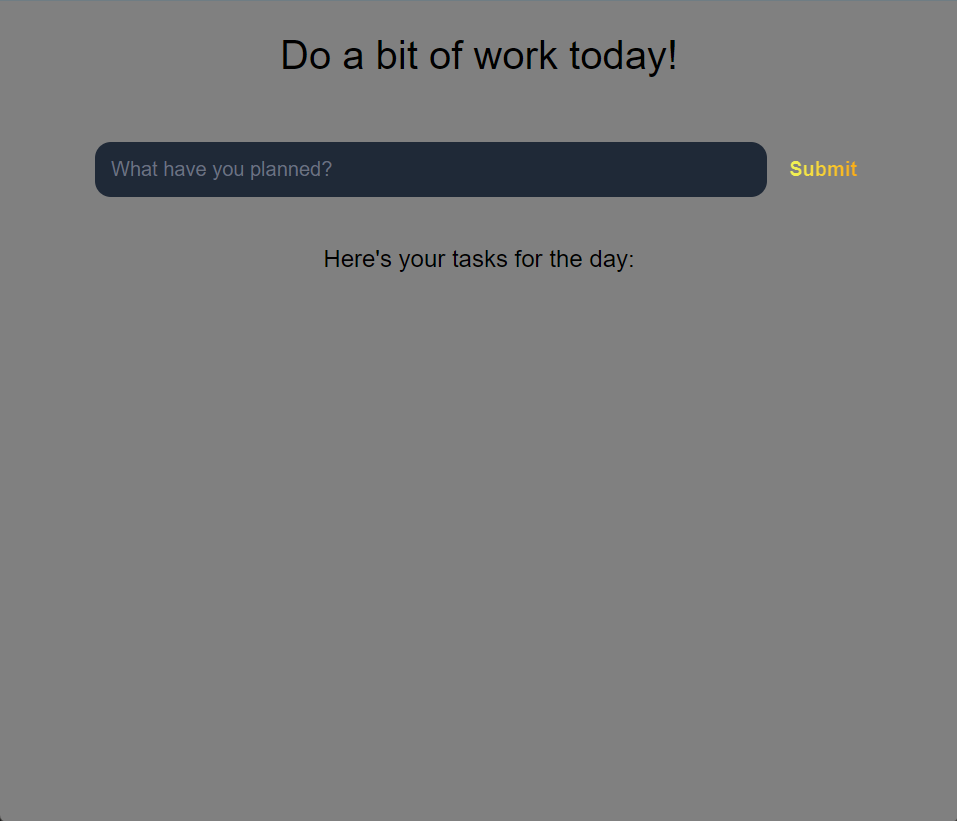
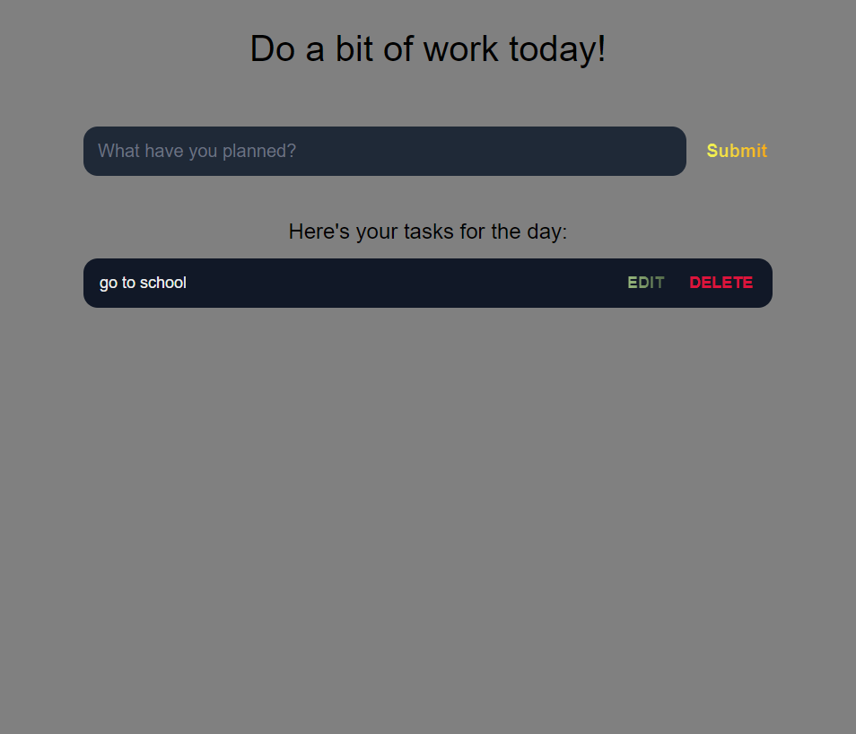
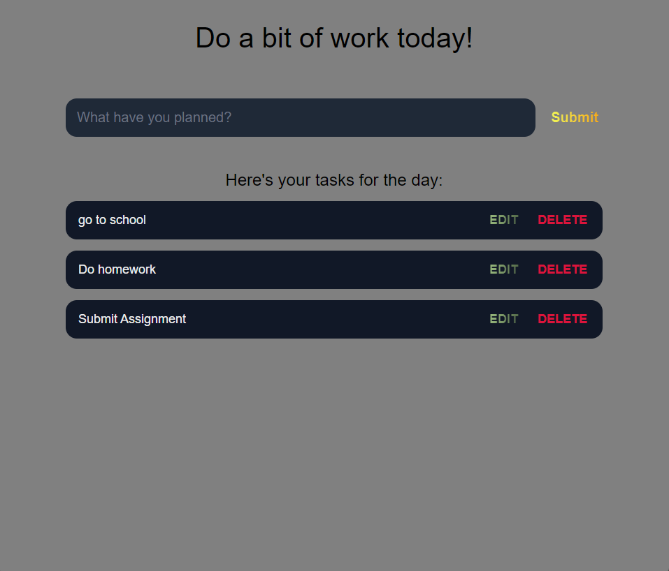
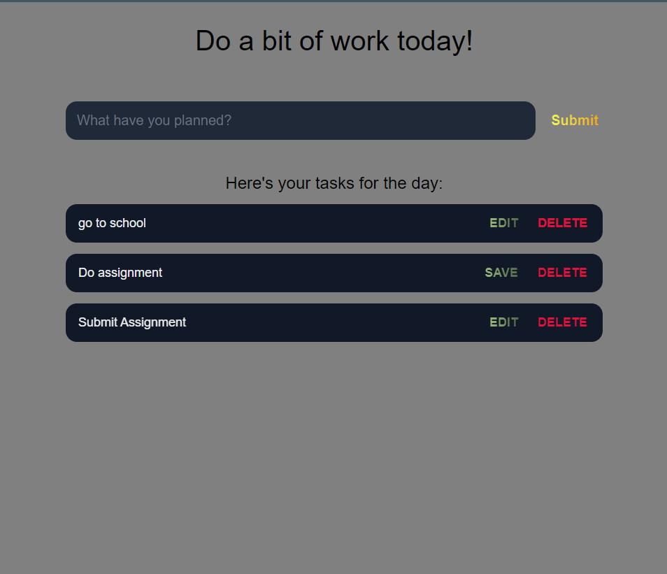
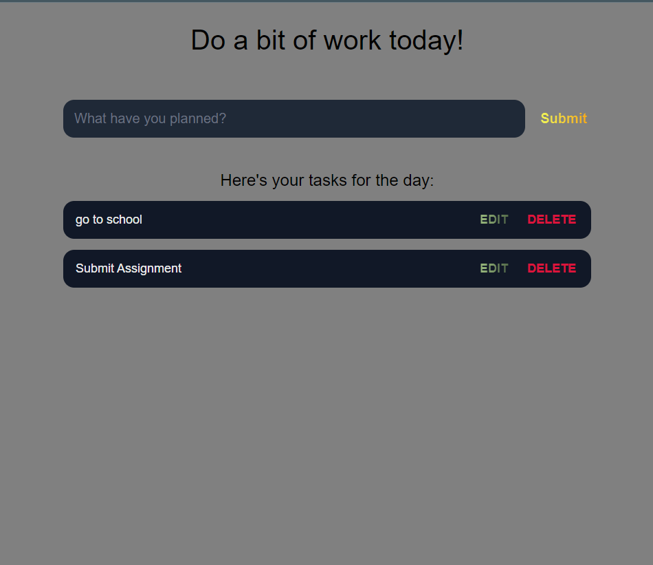

## TO-DO List 
This is a web application which can be used to make task lists. It has features like **Add task, Edit Task and Delete Task**. 

## Screenshots
### Add Task 1:

### Add Task 2:

### Add Task 3:

### Edit Task:

### Save Task:

### Delete Task:

## Web Link
[To-Do](https://spiffy-muffin-b75e1e.netlify.app/).

## Project Status
Currently the local storage functionality is not implemented. And also this works for single user. The future work is: 
* Adding local storage functionality
* Adding multi user functionality

